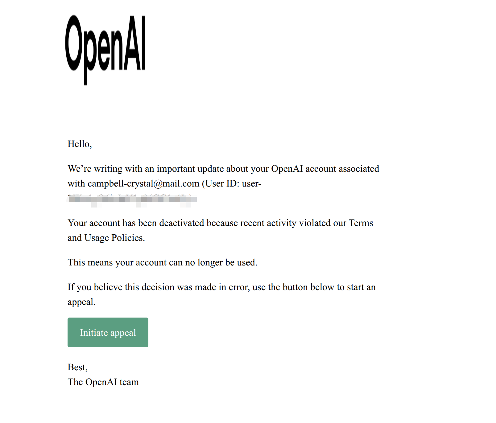
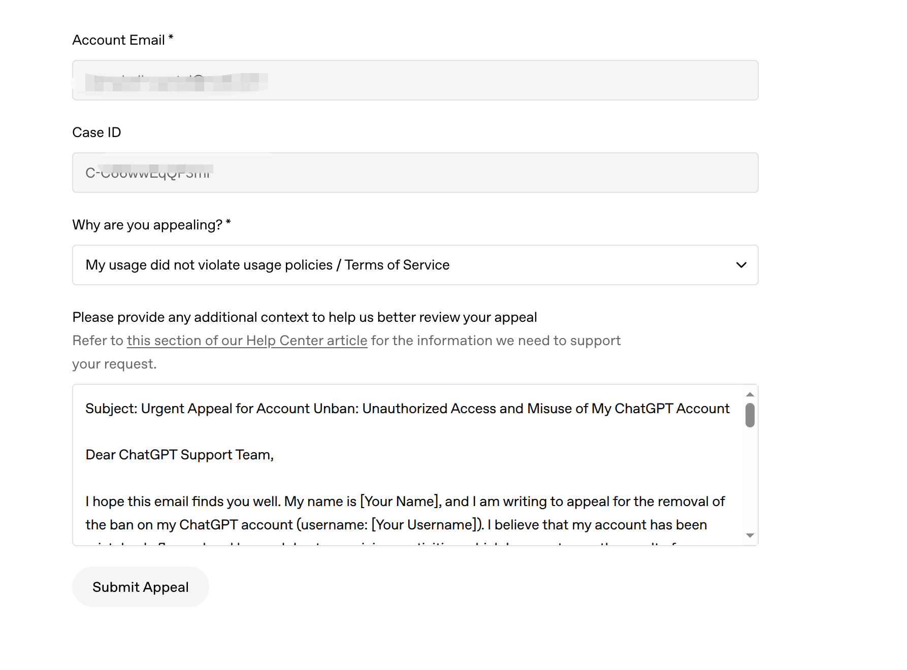
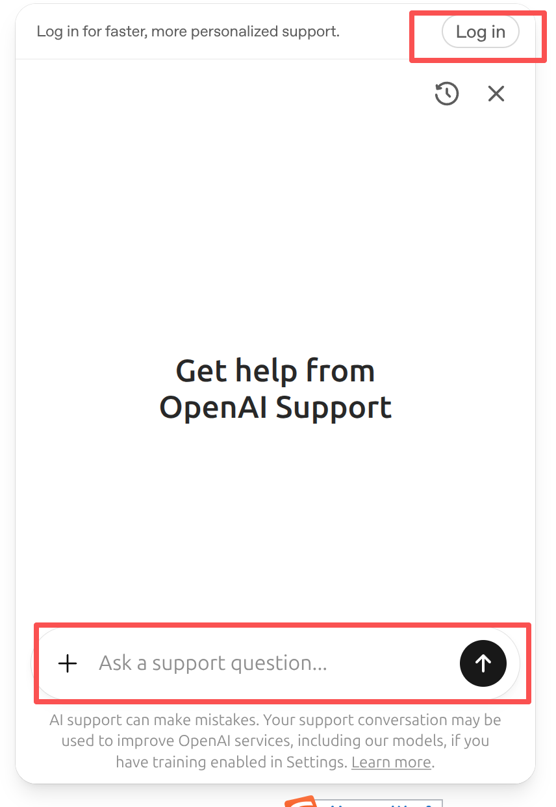
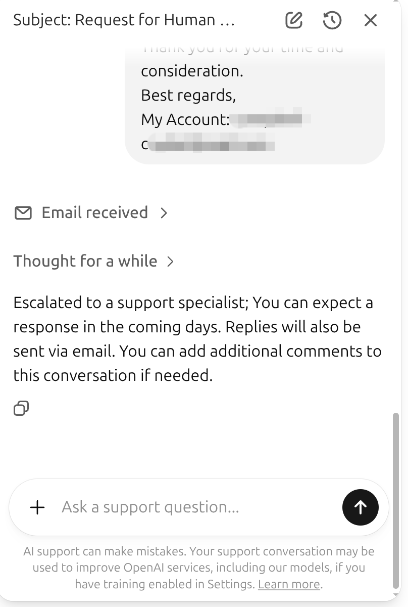
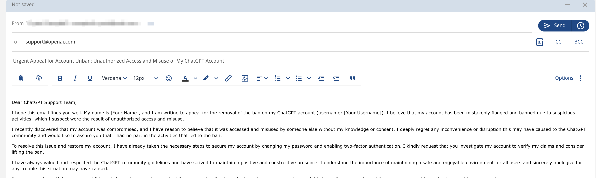

<div class="guide-eyebrow">账号支持 · 申诉与退款</div>

# GPT 封号后的申诉措施

<p class="guide-lead">收到账号停用通知后，可依次通过封号邮件、Help Center、官方论坛和支持邮箱提交申诉。建议先整理材料，再使用英文准确说明情况。</p>

<div class="guide-facts" role="list" aria-label="申诉要点">
  <div role="listitem">
    <strong>4 个</strong>
    <span>可尝试的申诉渠道</span>
  </div>
  <div role="listitem">
    <strong>英文</strong>
    <span>统一提交申诉材料</span>
  </div>
  <div role="listitem">
    <strong>完整</strong>
    <span>保留 Case ID 与记录</span>
  </div>
</div>

::: warning 提交语言
所有申诉内容都使用英文。请根据自己的实际情况撰写，不要原样复制固定模板。
:::

<nav class="guide-jump-nav" aria-label="页面快速导航">
  <a href="#申诉前准备">
    <span>01</span>
    <strong>准备材料</strong>
    <small>邮箱、Case ID 与记录</small>
  </a>
  <a href="#建议申诉顺序">
    <span>02</span>
    <strong>提交申诉</strong>
    <small>按建议顺序逐项处理</small>
  </a>
  <a href="#提交后的跟进">
    <span>03</span>
    <strong>持续跟进</strong>
    <small>保存回复并补充信息</small>
  </a>
  <a href="#退款说明">
    <span>04</span>
    <strong>退款处理</strong>
    <small>确认到账与服务费</small>
  </a>
</nav>

## 申诉前准备

提交前先整理以下信息，后续通过不同渠道申诉时保持内容一致：

- 查看封号邮件，确认邮件是否写明 `cyber` 等行为分类或其他具体原因；
- 准备账号邮箱、封号邮件中的 `Case ID` 和通知时间；
- 整理能够说明实际使用情况的对话记录、时间线或其他资料；
- 说明已经采取的账号安全措施，例如修改密码、检查登录设备或启用双重验证。

::: tip 撰写原则
说明应具体、真实且前后一致。如果确实发生过异常登录或账号被他人使用，可以写明发现时间、处理措施及希望官方核查的内容。
:::

## 建议申诉顺序

### 1. 从封号邮件发起申诉

GPT 通常会发送一封封号通知邮件。优先从该邮件进入申诉流程，即使第一次申诉被直接驳回，也应保留邮件和对应的 Case ID。



<p class="guide-image-caption">在封号通知邮件中找到 <code>Initiate appeal</code> 入口。</p>

1. 点击邮件中的 `Initiate appeal`，进入申诉页面；
2. 填写 `Account Email`、`Case ID` 和 `Why are you appealing?`；
3. 核对信息后提交，并保存提交页面或确认邮件。



<p class="guide-image-caption">填写账号邮箱、Case ID 和英文申诉说明。</p>

下面的内容仅用于提供英文写作结构。请结合真实情况调整主题、时间线、异常活动和已经采取的安全措施。

::: details 展开英文申诉信参考模板

```text
Subject: Urgent Appeal for Account Unban: Unauthorized Access and Misuse of My ChatGPT Account

Dear ChatGPT Support Team,

I hope this email finds you well. My name is [Your Name], and I am writing to appeal for the removal of the ban on my ChatGPT account (username: [Your Username]). I believe that my account has been mistakenly flagged and banned due to suspicious activities, which I suspect were the result of unauthorized access and misuse.

I recently discovered that my account was compromised, and I have reason to believe that it was accessed and misused by someone else without my knowledge or consent. I deeply regret any inconvenience or disruption this may have caused to the ChatGPT community and would like to assure you that I had no part in the activities that led to the ban.

To resolve this issue and restore my account, I have already taken the necessary steps to secure my account by changing my password and enabling two-factor authentication. I kindly request that you investigate my account to verify my claims and consider lifting the ban.

I have always valued and respected the ChatGPT community guidelines and have strived to maintain a positive and constructive presence. I understand the importance of maintaining a safe and enjoyable environment for all users and sincerely apologize for any trouble this situation may have caused.

Please let me know if there is any additional information or action required from my end to facilitate the investigation and resolution of this issue. I am more than willing to cooperate with any further inquiries you may have.

Thank you for your time and consideration. I eagerly await your response and hope that my account can be reinstated as soon as possible.

Best regards,
[Your Name]
[Your Account]
[Your Email Address]
```

:::

### 2. 通过 Help Center 联系支持

进入 [OpenAI Help Center](https://help.openai.com/en/collections/3742473-chatgpt)，使用右下角聊天窗口说明账号被停用，并尝试触发支持工单。



<p class="guide-image-caption">打开右下角聊天窗口，选择与账号登录或停用相关的问题。</p>



<p class="guide-image-caption">根据聊天窗口提示提交账号信息并等待邮件回复。</p>

::: info 聊天窗口提示
聊天窗口有时仅由 AI 回复，可能需要继续补充问题后才会生成工单或触发邮件回复。账号已被停用时通常无法完成 `Log in`，无需反复点击登录，以免增加新的登录地点记录。
:::

### 3. 在官方论坛发帖

前往 [OpenAI Community](https://community.openai.com/) 发帖说明情况。帖子中不要公开邮箱、Case ID、登录凭证、账单信息或其他敏感资料。

### 4. 向支持邮箱发送邮件

将整理好的英文申诉材料发送至 `support@openai.com`。邮件主题应简明说明账号停用与申诉诉求，正文中附上账号邮箱和 Case ID。



<p class="guide-image-caption">邮件内容保持简洁，重要资料集中放在正文中。</p>

## 提交后的跟进

1. 保存每次提交的时间、渠道、Case ID 和官方回复；
2. 收到补充资料要求后，在原邮件线程中回复，避免重复创建多个内容冲突的工单；
3. 补充对话记录等资料时，先移除与申诉无关的个人敏感信息；
4. 如果多个渠道均有回复，保持事实、时间线和诉求一致。

::: danger 封号结果说明
封号属于官方风控结果，可能是误判，也可能与中转反代、逆向、突破限制等违规操作有关。是否解封或退款，以官方最终审核结果为准。
:::

## 退款说明

<div class="refund-timeline" role="list" aria-label="退款处理流程">
  <div role="listitem">
    <span>01</span>
    <strong>等待原路退款</strong>
    <p>如官方同意退款，款项会退回虚拟卡。到账时间不固定，一般约为 2 周。</p>
  </div>
  <div role="listitem">
    <span>02</span>
    <strong>确认剩余金额</strong>
    <p>虚拟卡收到退款后收取 <code>18%</code> 技术服务费，剩余金额再进行退还。</p>
  </div>
</div>
