# 具体教程

## 注册webshare家宽

[Webshare | Fast & Affordable Proxies](https://www.webshare.io/)

若此前注册过账号直接登录（老号价格可能更便宜），推荐使用谷歌账号注册，注册后会赠送10个代理ip不用管直接进主界面即可

## 订阅套餐

点击左侧订阅-浏览方案，选择静态住宅-私有，代理数量点开选自定义1个，带宽选250GB每月

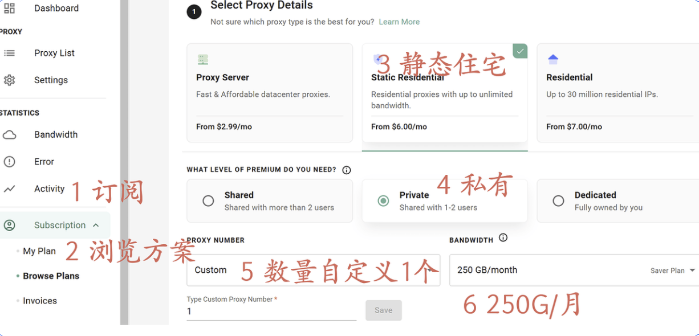

此处带宽为走代理的流量，后续会通过Clash分流来限定仅白名单走家宽代理，250G肯定够用了

不建议全局走这个代理，大部分网站不会风控ip，且美国的延迟会更高，手动将需要家宽的网站加到白名单即可

国家推荐美国，若有特殊需求可自行选择，代理刷新前两个选不刷新，第三个自定义选20个刷新次数，额外特性不需要选

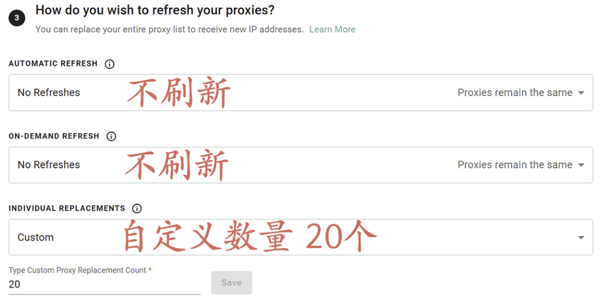

备注：若仅购买单月可选择22个，包年选择20个，这个数字是不加钱能选的最大数量，搭配后面选择ASN更换用不完，没必要加钱选50个

选好后右侧会显示价格，如果按照上述配置单月应为1美元，年付虽然显示-30%，但不同账号会有不同的折扣，我去年年底用谷歌注册的号是-33.3%包年就是8刀，新注册的号貌似都是-20%就是9.6刀

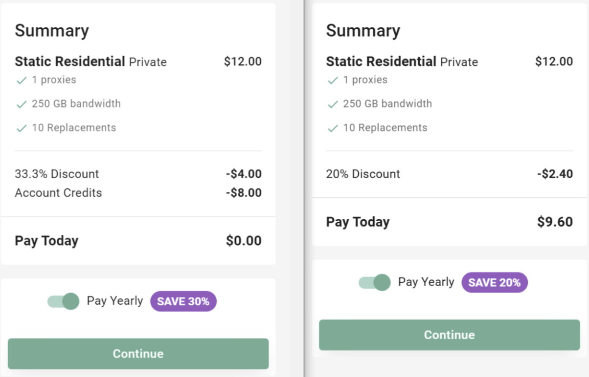

第一次使用建议买一个月即可，后续即使想要包年这1美元也不会浪费，直接买包年万一想退不一定好退

通过测试猜测的扣费规则是：每次创建订单会将完整的价格扣费并充值到余额，按天从余额扣款，后续更改套餐可以使用已有余额抵扣，所以如果用着感觉不错切换到包年这1刀是可以抵扣的

我付款用的是中行的莫奈万事达借记卡，对卡应该没有要求，只要是VISA、万事达、AMEX的就行

如果你有使用多个代理的需求（例如不同账号挂不同代理），建议注册多个账号每个账号买一个。同一个账号下的流量和刷新次数是共享的，例如你买了5个ip，平均每个ip每月就只能用50G流量和更换4次

## 测试代理

购买成功后，左侧代理列表里就可以看到代理信息，包含ip 端口 用户名 密码，如果对代理质量没有要求直接用就行，但还是建议通过以下方式测试并挑选代理，反正20次更换不用白不用

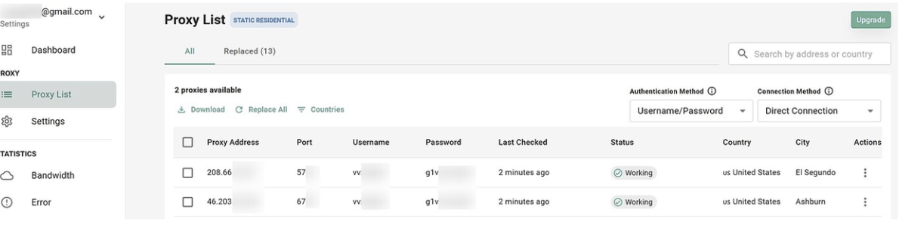

### ip质量测试

很全的IP查询站(查家宽纯净度)

```JSON
https://ipjiance.com

https://ipcheck.ing

https://ippure.com

https://iplark.com

https://pingip.cn

https://scamalytics.com

https://ip111.cn

https://whoer.net/zh

https://whoer.com/zh

https://www.ipipseek.com

https://ip.skk.moe

https://ip.sb

https://ping0.cc 不建议使用 有隐私风险且结果真实性存疑
```

只要没有显示IDC或者风控值特别高就可以，没必要追求所谓的双isp

## 更换代理

如果代理的风控值不满意，可以更换代理

首次默认分配的代理一般质量都不太行，除非风控值低且为双isp否则建议更换

在代理列表中勾选想要更换的代理ip（我买了2个，你们的界面应该是一个），点上方Replace进入更换界面

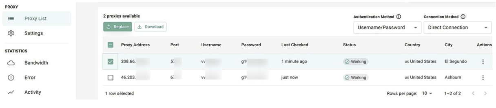

第一步默认会选中你刚刚勾选的代理，下一步选择第二个从具体ASN中添加代理，推荐选择ATT（ASN7018）的

我基本上把所有的都测试了一遍，ATT的质量相对最好，也可以自己试一试其他的，注意这里是所有国家的，如果选了其他国家的ASN会变国家，ATT里都是美国的

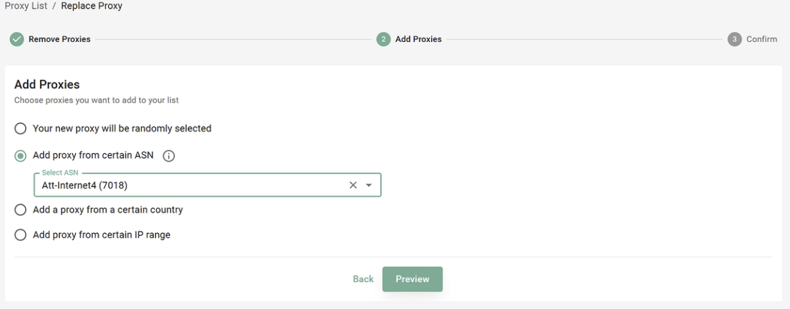

然后下一步提交，更换后此前的代理会立刻无法使用，代理列表中会显示最新的代理，这时候就重新按照第三步测试，可以多次更换直到选到满意的ip

此外，除了选择ASN外，更换时还可以选择指定的ip号段，但ip号段只能选自己曾经随机到过的。购买时选择的20次更换次数会每月重置，因此在每月套餐即将结束时可以多刷新几次把刷新次数用完，并记录较好的ip号段指定更换

同时，欢迎各位佬在评论区发一下自已挑选后满意的ip号段（前两部分即可，例如我截图中的208.66.x.x），以及该ip测试的风控值

## 配置Clash分流与链式代理

链式代理指的是将请求通过多个ip依次中转，我们要让ChatGPT认为自己是家宽就得把家宽放到最后一个，V2等软件可能把这个功能叫做落地代理

首先在全局拓展脚本里粘贴下面的内容，并把ip端口用户名密码换成自己的，作用是把自己的家宽代理添加到节点列表中，当然也可以手动编辑订阅添加节点

```Lua
function main(config, profileName) {
  const nodeList= 
  [
    {
      "name": "webshare",
      "server": "你的ip",
      "port": 你的端口,
      "type": "socks5",
      "username": "你的用户名",
      "password": "你的密码",
      "tls": false,
      "skip-cert-verify": true,
      // "udp": true
    },
  ]
  nodeList.forEach(node => {
    config.proxies.push(node);
  });
  return config;
}
```

然后在全局拓展配置中添加一个代理组，type为relay，proxies首先填自己的出国节点，然后再填webshare（上方我提供的拓展脚本里把节点命名为了webshare）

```YAML
- name: 链式代理
    type: relay
    proxies:
      - 低延迟
      - webshare
```

最后在全局拓展配置的分流规则中把需要家宽代理的分流到链式代理上

```Markdown
rules:
  - RULE-SET,ai,链式代理
  - RULE-SET,AI,链式代理
  - RULE-SET,OpenAI,链式代理
  - RULE-SET,Gemini,链式代理
  - RULE-SET,Claude,链式代理
  - DOMAIN-SUFFIX,oaistatic.com,链式代理
  - DOMAIN-SUFFIX,cdn.oaistatic.com,链式代理
  - DOMAIN-SUFFIX,gstatic.com,链式代理
```

下面是我自己正在使用的完整全局扩展配置，算是整合了此前一些人的配置，没有过多特殊需求可以直接复制使用

我的配置里没有给不同类别添加不同分流，只保留了普通代理和链式代理，如果有分流需求也可以在自己的基础上参考添加

```Plain
# Profile Enhancement Merge Template for Clash Verge
proxy-groups:
  - name: 低延迟
    include-all: true
    type: select
    proxies:
      - 自动选择

  - name: 高带宽
    include-all: true
    type: select
    proxies:
      - 自动选择

  - name: 链式代理
    type: relay
    proxies:
      - 低延迟
      - webshare

  - name: 自动选择
    type: url-test
    include-all: true
    url: http://www.gstatic.com/generate_204
    interval: 1800

rule-providers:
  ai:
    type: http
    behavior: classical
    format: yaml
    path: ./rules/ai.yaml
    url: "https://fastly.jsdelivr.net/gh/MadisonWirtanen/WARP-Clash-with-ZJU-Rules@main/ai.yaml"
    interval: 86400

  AI:
    type: http
    behavior: classical
    url: https://github.com/Repcz/Tool/raw/X/Clash/Rules/AI.list
    path: ./rule-providers/AI.list
    interval: 86400
  
  OpenAI: 
    type: http
    behavior: classical
    format: yaml
    path: ./rules/OpenAI.yaml
    url: "https://cdn.jsdelivr.net/gh/zuluion/Clash-Template-Config@master/Filter/OpenAI.yaml"
    interval: 86400
    
  Gemini: 
    type: http
    behavior: classical
    format: yaml
    path: ./rules/Gemini.yaml
    url: "https://cdn.jsdelivr.net/gh/zuluion/Clash-Template-Config@master/Filter/Gemini.yaml"
    interval: 86400

  Claude: 
    type: http
    behavior: classical
    format: yaml
    path: ./rules/Claude.yaml
    url: "https://cdn.jsdelivr.net/gh/zuluion/Clash-Template-Config@master/Filter/Claude.yaml"
    interval: 86400

  AD:
    type: http
    behavior: classical
    url: https://adrules.top/adrules_domainset.txt
    path: ./rule-providers/AD.list
    interval: 86400

  AdBlock:
    type: http
    behavior: classical
    format: yaml
    path: ./rules/AdBlock.yaml
    url: "https://cdn.jsdelivr.net/gh/zuluion/Clash-Template-Config@master/Filter/AdBlock.yaml"
    interval: 86400
    
  BanAD:
    type: http
    behavior: domain
    url: "https://raw.githubusercontent.com/ACL4SSR/ACL4SSR/master/Clash/BanAD.list"
    path: ./ruleset/BanAD.yaml
    interval: 86400

  BanProgramAD:
    type: http
    behavior: domain
    url: "https://raw.githubusercontent.com/ACL4SSR/ACL4SSR/master/Clash/BanProgramAD.list"
    path: ./ruleset/BanProgramAD.yaml
    interval: 86400

  BanEasyList:
    type: http
    behavior: domain
    url: "https://raw.githubusercontent.com/ACL4SSR/ACL4SSR/master/Clash/BanEasyList.list"
    path: ./ruleset/BanEasyList.yaml
    interval: 86400

  reject:
    type: http
    behavior: domain
    url: "https://cdn.jsdelivr.net/gh/Loyalsoldier/clash-rules@release/reject.txt"
    path: ./ruleset/reject.yaml
    interval: 86400

  collection: 
    type: http
    behavior: classical
    format: yaml
    path: ./rules/collection.yaml
    url: "https://gist.githubusercontent.com/cnfree8964/0864fd1d2e88936a095fb40d74ce4993/raw/collection.yaml"
    interval: 86400

  gfw:
    type: http
    behavior: domain
    url: "https://cdn.jsdelivr.net/gh/Loyalsoldier/clash-rules@release/gfw.txt"
    path: ./ruleset/gfw.yaml
    interval: 86400

  proxy:
    type: http
    behavior: domain
    url: "https://cdn.jsdelivr.net/gh/Loyalsoldier/clash-rules@release/proxy.txt"
    path: ./ruleset/proxy.yaml
    interval: 86400

  tld-not-cn:
    type: http
    behavior: domain
    url: "https://cdn.jsdelivr.net/gh/Loyalsoldier/clash-rules@release/tld-not-cn.txt"
    path: ./ruleset/tld-not-cn.yaml
    interval: 86400

  ProxyGFWlist:
    type: http
    behavior: domain
    url: "https://raw.githubusercontent.com/ACL4SSR/ACL4SSR/master/Clash/ProxyGFWlist.list"
    path: ./ruleset/BanEasyList.yaml
    interval: 86400

  ProxyClient: 
    type: http
    behavior: classical
    format: yaml
    path: ./rules/ProxyClient.yaml
    url: "https://cdn.jsdelivr.net/gh/zuluion/Clash-Template-Config@master/Filter/ProxyClient.yaml"
    interval: 86400

  ChinaDomain:
    type: http
    behavior: classical
    format: yaml
    path: ./rules/ChinaDomain.yaml
    url: "https://raw.githubusercontent.com/ACL4SSR/ACL4SSR/master/Clash/ChinaDomain.list"
    interval: 86400

  ChinaCompanyIp:
    type: http
    behavior: classical
    format: yaml
    path: ./rules/ChinaCompanyIp.yaml
    url: "https://raw.githubusercontent.com/ACL4SSR/ACL4SSR/master/Clash/ChinaCompanyIp.list"
    interval: 86400

  China: 
    type: http
    behavior: classical
    format: yaml
    path: ./rules/China.yaml
    url: "https://cdn.jsdelivr.net/gh/zuluion/Clash-Template-Config@master/Filter/China.yaml"
    interval: 86400

  cncidr:
    type: http
    behavior: ipcidr
    url: "https://cdn.jsdelivr.net/gh/Loyalsoldier/clash-rules@release/cncidr.txt"
    path: ./ruleset/cncidr.yaml
    interval: 86400

  lancidr:
    type: http
    behavior: ipcidr
    url: "https://cdn.jsdelivr.net/gh/Loyalsoldier/clash-rules@release/lancidr.txt"
    path: ./ruleset/lancidr.yaml
    interval: 86400

profile:
  store-selected: true

dns:
  enable: true
  ipv6: false
  listen: 0.0.0.0:53
  enhanced-mode: fake-ip
  fake-ip-range: 198.18.0.1/16
  nameserver:
  - https://doh.pub/dns-query
  - https://dns.alidns.com/dns-query
  prefer-h3: true
  nameserver-policy: # 国内的DNS服务器没必要使用doh/dot加密，不加密速度更快
    geosite:cn:
    # - system
    - 223.5.5.5
    - 114.114.114.114
    - 180.184.1.1
    - 119.29.29.29
    - 180.76.76.76
  proxy-server-nameserver: # 解析代理节点的DNS服务器
  - https://doh.pub/dns-query
  - https://dns.alidns.com/dns-query
  fallback: []
  fake-ip-filter: # fake-ip的副作用，导致Windows上会显示无网络，屏蔽微软的一些域名即可解决
  - '*.lan'
  - 'localhost.ptlogin2.qq.com'
  - 'localhost.sec.qq.com'
  - dns.msftncsi.com
  - www.msftncsi.com
  - www.msftconnecttest.com
unified-delay: true
tcp-concurrent: true

tun:
  enable: true
  stack: mixed
  auto-route: true
  auto-redirect: true
  auto-detect-interface: true
  dns-hijack:
    - any:53
    - tcp://any:53
  device: utun0
  mtu: 1500
  strict-route: true
  gso: true
  gso-max-size: 65536
  udp-timeout: 300
  iproute2-table-index: 2022
  iproute2-rule-index: 9000
  endpoint-independent-nat: false
  route-address-set:
    - ruleset-1
  route-exclude-address-set:
    - ruleset-2
  route-address:
    - 0.0.0.0/1
    - 128.0.0.0/1
    - "::/1"
    - "8000::/1"
  route-exclude-address:
    - 192.168.0.0/16
    - fc00::/7
  include-interface:
    - eth0
  exclude-interface:
    - eth1
  include-uid:
    - 0
  include-uid-range:
    - 1000:9999
  exclude-uid:
    - 1000
  exclude-uid-range:
    - 1000:9999
  include-android-user:
    - 0
    - 10
  include-package:
    - com.android.chrome
  exclude-package:
    - com.android.captiveportallogin

rules:
  - RULE-SET,ai,链式代理
  - RULE-SET,AI,链式代理
  - RULE-SET,OpenAI,链式代理
  - RULE-SET,Gemini,链式代理
  - RULE-SET,Claude,链式代理
  - DOMAIN-SUFFIX,oaistatic.com,链式代理
  - DOMAIN-SUFFIX,cdn.oaistatic.com,链式代理
  - DOMAIN-SUFFIX,gstatic.com,链式代理

  - DOMAIN-SUFFIX,googleapis.cn,低延迟
  - DOMAIN-SUFFIX,oncatapult.com,DIRECT
  - DOMAIN-SUFFIX,epicgames.com,DIRECT
  - DOMAIN-SUFFIX,linux.do,DIRECT

  - GEOSITE,category-ads-all,REJECT

  - RULE-SET,AD,REJECT
  - RULE-SET,AdBlock,REJECT
  - RULE-SET,reject,REJECT
  - RULE-SET,BanAD,REJECT
  - RULE-SET,BanProgramAD,REJECT
  - RULE-SET,BanEasyList,REJECT

  - GEOSITE,private,DIRECT
  - GEOIP,private,DIRECT,no-resolve

  - GEOSITE,category-scholar-!cn,低延迟
  - GEOSITE,microsoft@cn,DIRECT
  - GEOSITE,steam@cn,DIRECT
  - GEOSITE,category-games@cn,DIRECT
  - GEOSITE,cn,DIRECT
  - GEOIP,CN,DIRECT,no-resolve
  
  # - RULE-SET,gfw,低延迟
  # - RULE-SET,proxy,低延迟
  # - RULE-SET,tld-not-cn,低延迟
  # - RULE-SET,ProxyGFWlist,低延迟
  # - RULE-SET,ProxyClient,低延迟
  - RULE-SET,ChinaDomain,DIRECT,no-resolve
  - RULE-SET,ChinaCompanyIp,DIRECT,no-resolve
  - RULE-SET,cncidr,DIRECT,no-resolve
  - RULE-SET,China,DIRECT,no-resolve
  - RULE-SET,lancidr,DIRECT,no-resolve
  - RULE-SET,collection,DIRECT,no-resolve

  - GEOSITE,geolocation-cn,DIRECT
  - MATCH,低延迟
```

## 配置V2ray落地代理

此步骤与上一步配置Clash分流与链式代理独立，指的是不使用Clash，仅通过V2ray使用家宽代理

V2ray不支持分流，即所有被代理流量（包括需要大带宽的视频，低延迟的游戏等）都会通过家宽代理，计入每月250GB的额度且美国延迟200+ms，若无特殊需求建议参考上方Clash配置教程

首先点击左上角服务器-添加SOCKS服务器，并将自己购买的ip端口用户名密码填入，别名填webshare（可以自定义，后续会用到），右上角协议应该无所谓我填的sing_box

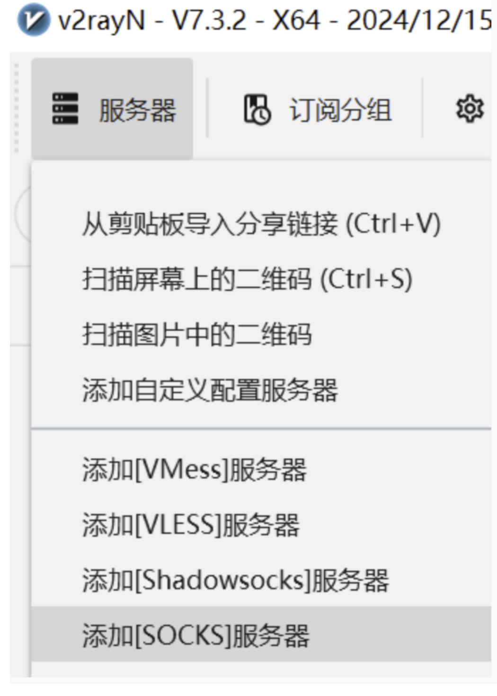


然后在订阅设置中点开你自己在用的订阅分组的设置，在落地代理别名填入webshare

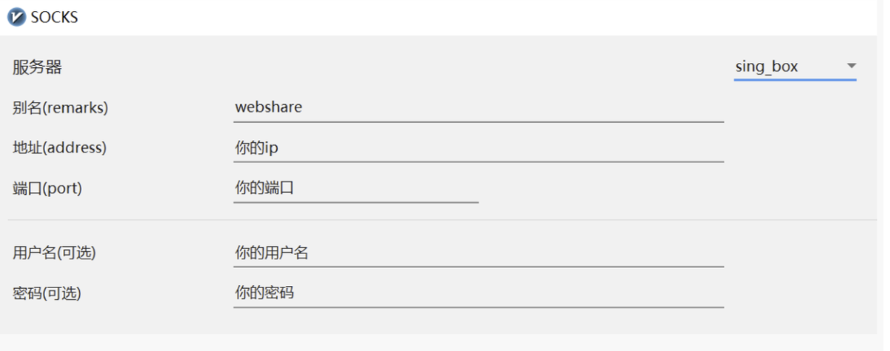

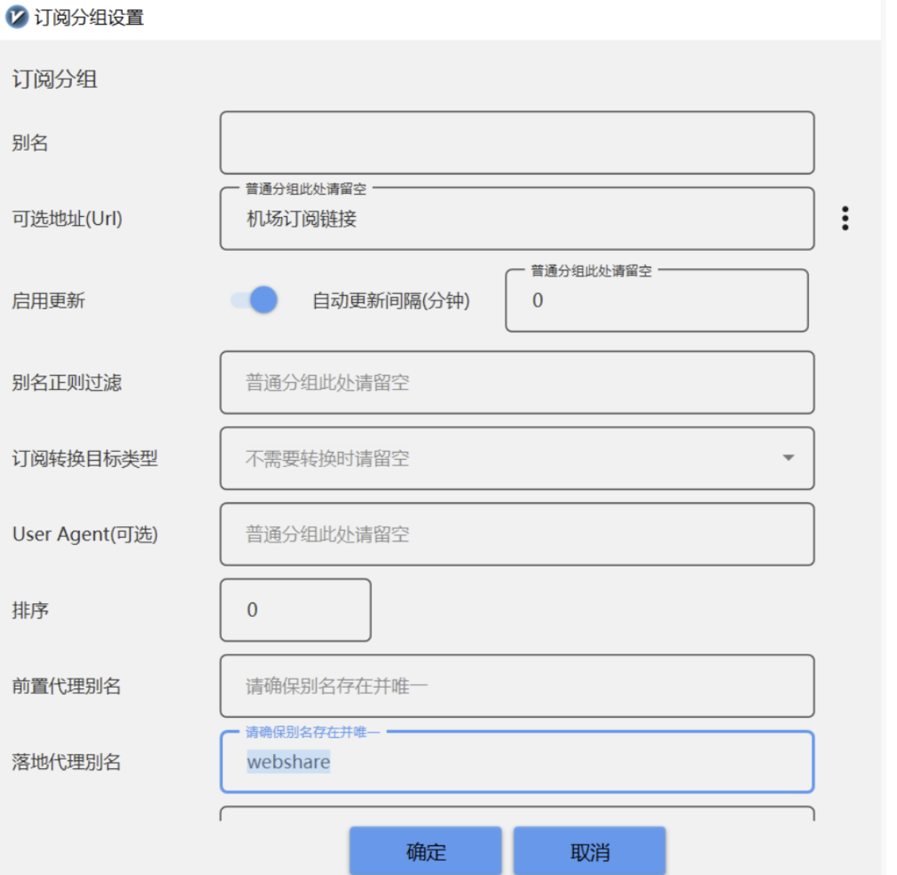


保存后更新一次订阅，并点击上方重启服务

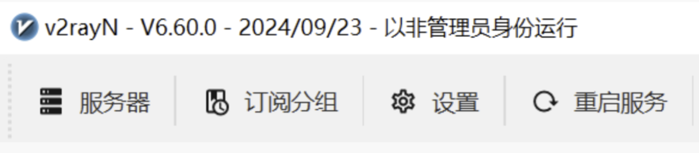

配置完成后可以打开代理访问国外ip测试网站检测是否为家宽ip

## 单月订阅转换包年

如果买了一个月感觉不错，可以把自己的订阅更新为包年订阅，当然也可以等第一个月用完了再重新买包年

在订阅的还未用完的条件下，可以直接按照购买流程重新选中一次，并勾选包年，原始的优惠价格是8美元或9.6美元，下方的Account Credits就是此前订阅中购买后还未使用的余额，余额是按天扣费的（每天约0.03美元），可以直接抵扣

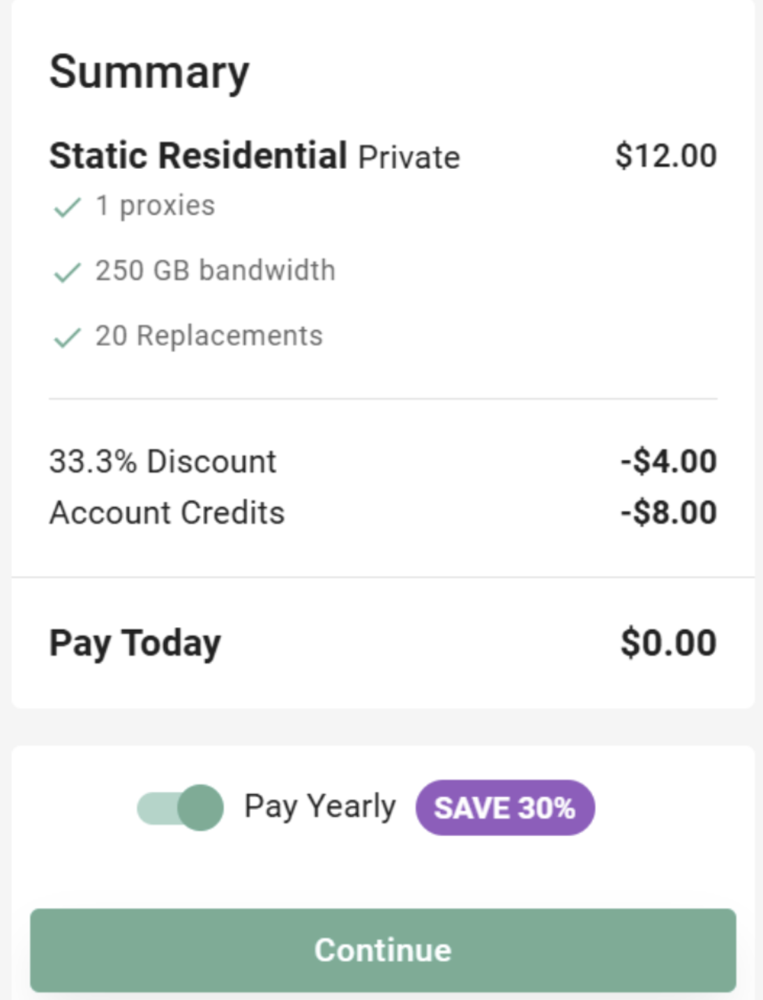
