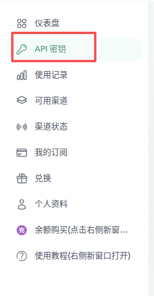
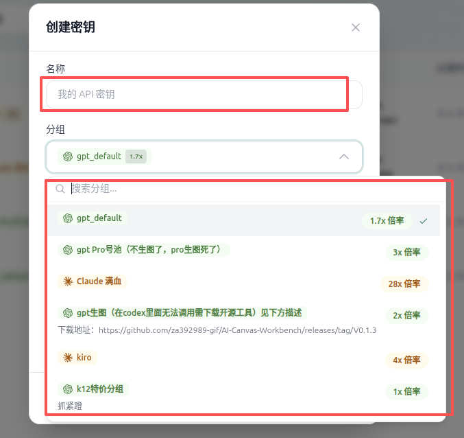
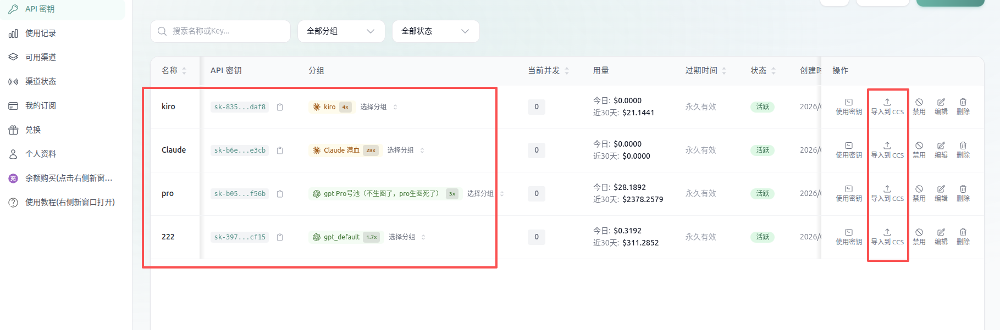

# 中转站密钥使用教程

根据不同的大模型提供商，可以生成不同类型大模型提供商的密钥

1. 进入`API密钥`菜单

   

2. 点击`创建密钥`

   1. 名称随便填写
   2. 分组，可以选择不同的大模型提供厂商(可以根据图标区分是`GPT,Claude,Gemino,Grok`等)
   3. 点击 `创建`

   

3. 列表就会出现刚刚创建的密钥

   

4. 使用密钥，强烈推荐使用`ccs`方式导入，如没有下载`ccs`，先下载`ccs`并进行配置 ，[点我](./ccs-tutorial.md) 

