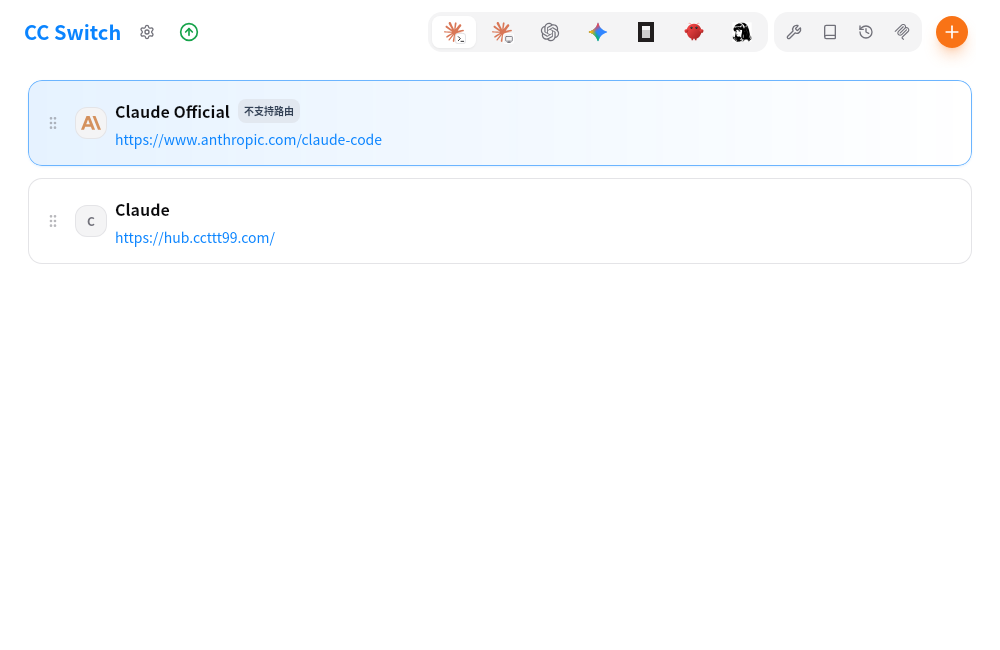
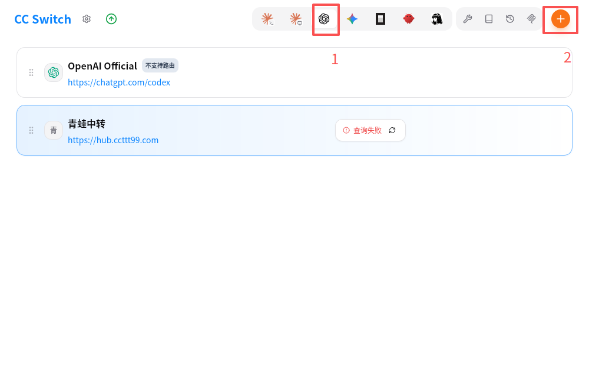
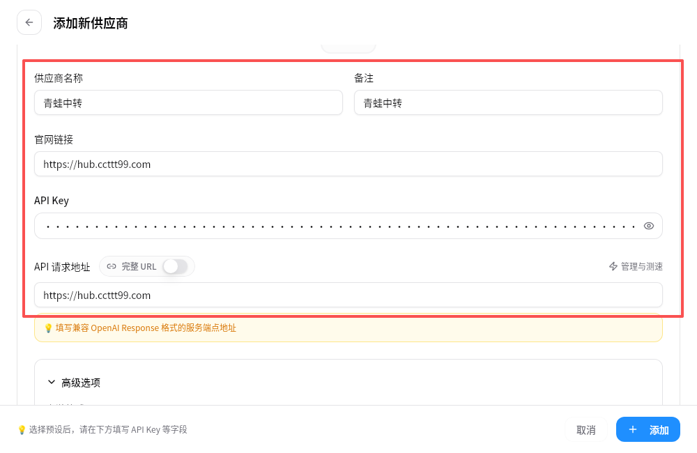
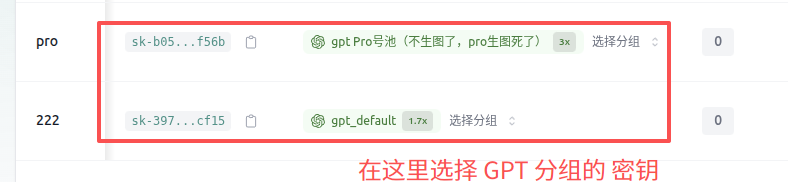
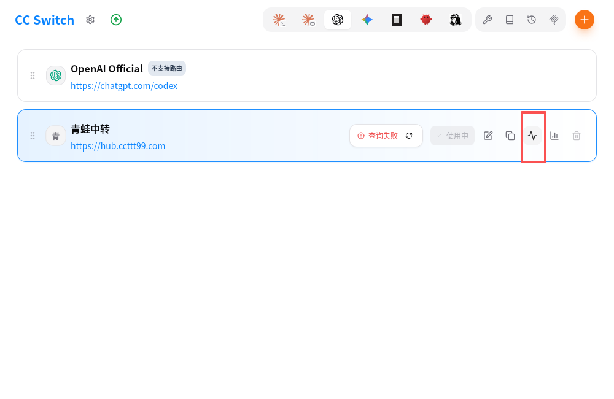
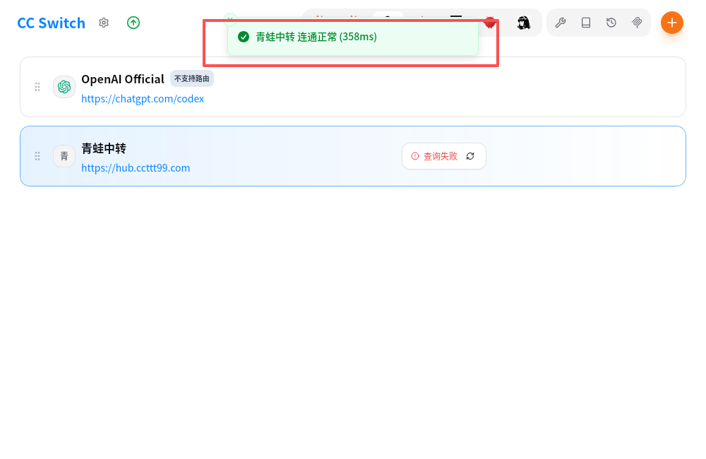

# CCS(CC Switch使用教程)

## 什么是 CC Switch

CC Switch 是一款跨平台桌面应用，专为使用 AI 工具的开发者设计。它帮助你统一管理 **Claude Code**、**Claude Desktop**、**Codex**、**Gemini CLI**、**OpenCode**、**OpenClaw** 和 **Hermes** 等受管应用的配置。

## 解决什么问题

在日常开发中，你可能会遇到这些痛点：

- **多供应商切换麻烦**：使用不同的 API 供应商（官方、中转服务商），需要手动修改配置文件
- **配置分散难管理**：Claude Code、Claude Desktop、Codex、Gemini、OpenCode、OpenClaw、Hermes 各有独立的配置文件，格式不同
- **无法监控用量**：不知道 API 调用了多少次，花了多少钱
- **服务不稳定**：单一供应商出问题时，整个工作流中断

CC Switch 通过统一的界面解决这些问题。

## 核心功能

### 供应商管理
- 一键切换多个 API 供应商配置
- 支持预设模板，快速添加常用供应商
- 统一供应商功能，跨应用共享配置
- Claude Desktop 第三方供应商、直连模式与模型映射
- 用量查询与余额显示
- 端点速度测试

### 扩展功能
- **MCP 服务器**：管理 Model Context Protocol 服务器，扩展 AI 能力
- **Prompts**：管理系统提示词预设，快速切换不同场景
- **Skills**：安装和管理技能扩展

### 代理与高可用
- 本地代理服务，记录请求日志和用量统计
- 自动故障转移，主供应商失败时自动切换备用
- 熔断器机制，防止频繁重试失败的供应商
- 详细的 Token 用量追踪与成本估算

## 快速开始

### 下载/安装

打开浏览器输入地址 `https://ccswitch.io/zh/` ，选择合适的操作系统进行下载并进行安装。

### 使用

打开`ccs`软件，如下图所示

#### GPT/Codex使用教程

1. 点击`GPT`图标，并点击`+`按钮新增配置

   

2. 填入配置信息

   1. 供应商名称、备注 随便填写即可
   2. 官网链接 填入：`https://hub.ccttt99.com`
   3. API Key 填入在中转站生成的 `API密钥`（注意分组一定要选择`GPT`类型的分组）

   

   

4.填入后点击保存

5.测试连通性，点击测试按钮，显示`连通正常`则说明配置正确

#### Claude/Grok/Gemini 使用教程

与`GPT/Codex 使用教程`配置同理，只需要选择中转站的 `Claude/Grok/Gemini`分组即可
