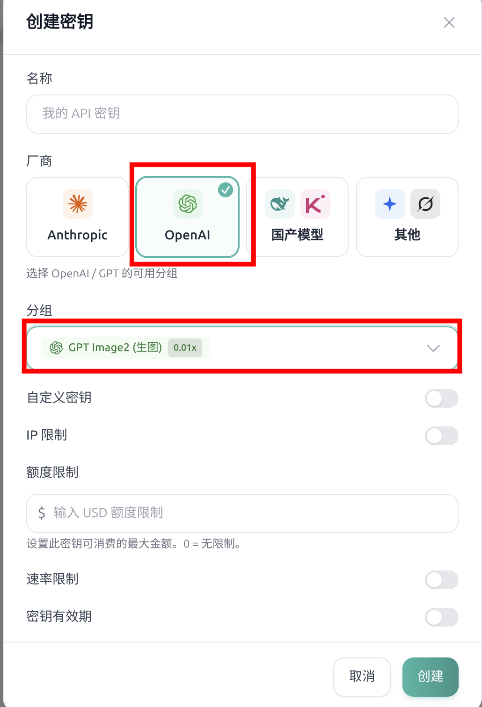
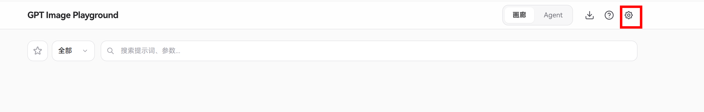
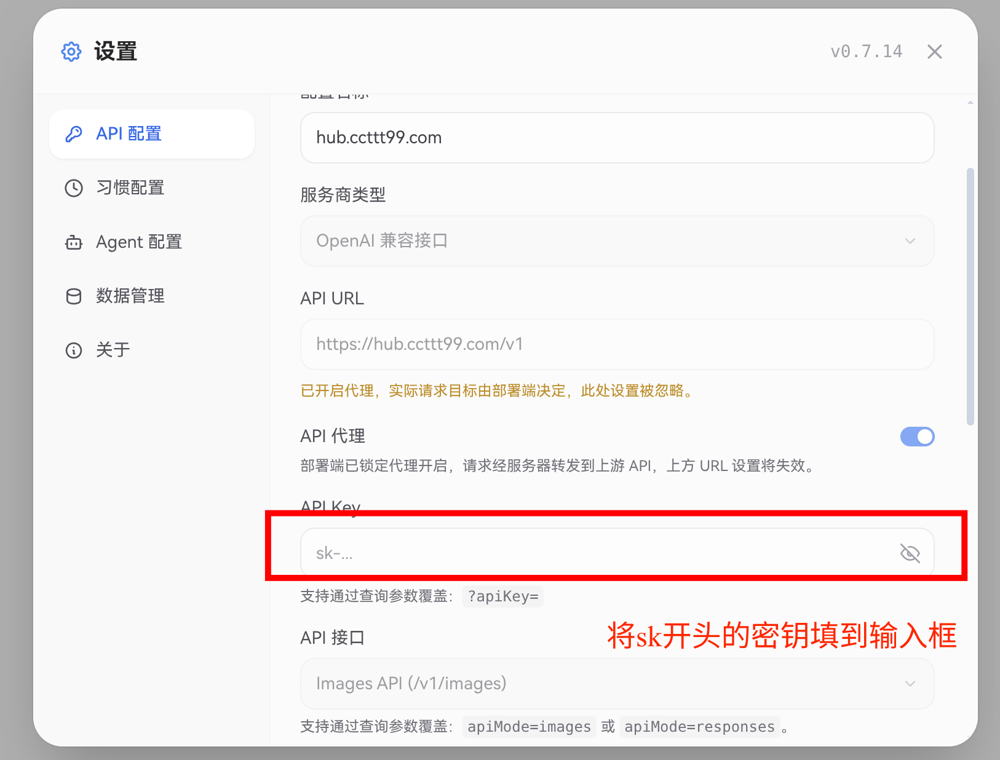
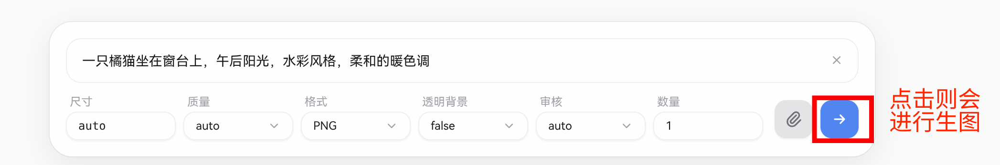
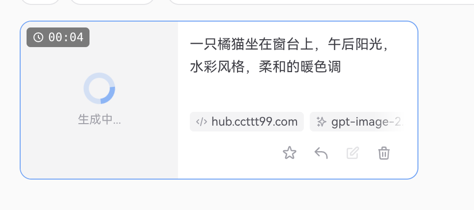
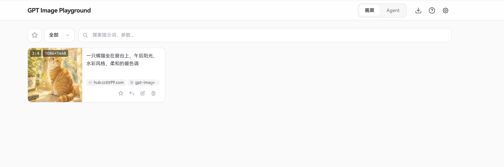

# AI 生图使用教程

访问地址：**<https://image.ccttt99.com/>**

这是一个在浏览器里直接使用的 AI 生图工具，支持文字生图、参考图改图、批量出图。打开网页、填一次自己的 API Key，就可以开始用了。

> 你的 API Key、生成记录和图片都只保存在**你自己的浏览器里**，不会上传到服务器。换浏览器或清除浏览器数据后需要重新填写 Key，历史记录也会一起清空，重要的图请及时下载。

---

## 一、准备：获取 API Key

1. 登录 <https://hub.ccttt99.com/>；
2. 进入「API 密钥」菜单，新建一个密钥；
3. 复制以 `sk-` 开头的密钥字符串，后面要用。

> 📷 图：hub 后台创建密钥的位置
>
> 

---

## 二、首次配置（只需一次）

1. 打开 <https://image.ccttt99.com/>；
2. 点击右上角的 **⚙️ 设置** 图标；
3. 在「API 配置」页里，已经有一个名为 **hub.ccttt99.com** 的配置，API 地址和模型（`gpt-image-2.5-flare`）都预填好了，这两项被锁定不可修改；
4. 把刚复制的 Key 粘贴到 **API Key** 输入框；
5. 关闭设置窗口即可。

> 📷 图：设置页 API Key 输入框
>
> 

> 

「API 代理」开关已由管理员固定为开启状态，请不要尝试关闭，它是保证请求能正常发出的必要设置。

---

## 三、生成第一张图

1. 在页面底部的输入框里描述你想要的画面，中英文都可以。写得越具体效果越好，例如：

   > 一只橘猫坐在窗台上，午后阳光，水彩风格，柔和的暖色调

2. 在输入框附近可以调整：
   - **尺寸**：提供 1K / 2K / 4K 预设，也可以自定义宽高或比例（如 `16:9`）；
   - **质量**：越高越清晰，耗时和费用也越高；
   - **数量**：一次生成几张；
   - **格式**：PNG / JPEG / WebP。
3. 点击发送。生成需要几十秒到一两分钟，请耐心等待，卡片上会显示生成进度。

> 📷 图：输入框和参数区
>
> 

生成完成后图片会出现在上方的画廊里，点击可全屏查看(下方展示图片生成中)。

生图中

生成完成

---

## 四、基于一张图继续改（图生图）

这是最常用的进阶功能：拿一张已有的图当"参考"，让 AI 保持它的风格、构图或主体，再生成新的图。

**方法 A：用刚生成的结果继续改**

1. 在画廊里**右键点击**（手机长按）满意的那张图；
2. 选择 **编辑**，这张图就会被加到输入框上方的参考图区，提示"已加入参考图"；
3. 在输入框写下修改要求，例如「保持同样的风格和配色，把猫换成柴犬」；
4. 发送。

**方法 B：用自己的图片**

- 把图片**拖进**页面，或者
- 复制图片后在输入框 **Ctrl+V** 粘贴，或者
- 点击参考图区的上传按钮选择文件。

最多可以同时放 16 张参考图。放多张同风格的图，风格会更稳定。

**只改局部（遮罩）**

在参考图上点击「遮罩编辑」，用画笔涂出想修改的区域，其余部分保持不变。适合换背景、去掉某个物体、改衣服颜色等场景。

---

## 五、复用之前的提示词和参数

点击画廊里的任意历史任务打开详情：

- **复制提示词**：一键复制当时的描述文字；
- **复用配置**：把当时的尺寸、质量、数量等参数一次性填回输入区；
- **提示词已被改写**：AI 会在内部把你的描述扩写得更详细，这里能看到它实际使用的版本。想要"同款风格"时，直接拿这段改写后的文字当模板会更准。

---

## 六、管理和下载图片

- **下载**：右键图片 → 下载；多张图时可选「下载全部」；
- **收藏**：把满意的图加入收藏夹，可以建多个收藏夹分类整理；
- **批量操作**：电脑上按住 Ctrl 点选多张，或在空白处拖拽框选；手机上左滑卡片选中。选中后底部会出现批量下载 / 收藏 / 删除按钮；
- **备份**：设置里可以把所有历史记录打包导出成 ZIP。

---

## 七、常见问题

**提示 API Key 无效 / 401**
Key 复制不完整或已被删除。回到 hub 后台确认，重新复制粘贴。

**提示余额不足 / 403**
到 hub 后台查看余额。

**返回一大段英文网页，里面有 `502 Bad gateway`**
上游服务临时故障，不是你的操作问题。等几分钟再试；持续出现请联系管理员。

**生成很久之后失败，提示超时**
图片尺寸太大或质量太高时偶尔发生。降低尺寸或质量重试，或者减少单次生成的数量。

**页面上看到的配置不对 / 想恢复默认**
进入设置 → API 配置，删掉自己新建的多余配置。预置的 hub.ccttt99.com 配置不会被删除。

**换了电脑或浏览器，之前的图不见了**
所有数据都在原来那个浏览器里，服务器没有副本。请在原浏览器里下载或导出备份。

---

## 八、写好提示词的小技巧

- 说清楚 **主体 + 场景 + 风格 + 光线/色调**，四要素齐了效果通常就不错；
- 想要特定画风可以直接点名：水彩、油画、赛博朋克、极简扁平插画、日系动漫、电影感写实……；
- 想让文字出现在图里，把文字用引号标出来，例如 `海报上写着 "Summer Sale"`；
- 第一次出图不满意很正常，把它加为参考图再补充一两句要求，往往比重写整个提示词更有效。

