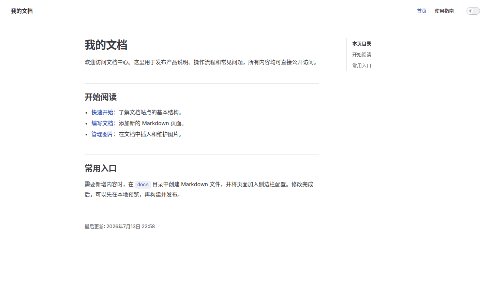

# 管理图片

图片文件与 Markdown 一起保存在 Git 中。推荐使用小写英文文件名，并用短横线分隔单词。

## 文章专用图片

只在一篇或一组相关文档中使用的图片，放在文档旁边的 `images` 目录：

```text
docs/guide/
├── installation.md
└── images/
    └── installation-screen.png
```

在 Markdown 中使用相对路径：

```markdown

```

下面这张站点首页截图就是通过相对路径加载的文章图片：



## 全站公共图片

Logo 等被多篇文档使用的图片放在 `docs/public/images/`：

```text
docs/public/images/logo.png
```

引用时使用以 `/` 开头的路径：

```markdown

```

## 图片维护建议

- 截图优先使用 PNG，照片优先使用 JPEG 或 WebP。
- 上传前裁掉无关区域，避免页面加载不必要的大图。
- 图片文件随相关 Markdown 一起提交，避免出现失效引用。
- 为图片填写有意义的替代文字，方便图片无法显示时理解内容。
